# 前端架构图和模块图文档

## 1. 技术栈概览

### 1.1 核心技术栈
- **前端框架**: React 18.3.1 + TypeScript
- **构建工具**: Vite 6.3.5 + SWC
- **样式方案**: Tailwind CSS + Radix UI
- **状态管理**: React Hooks (useState, useEffect)
- **动画库**: Motion (Framer Motion)
- **UI组件库**: Radix UI + 自定义组件
- **图标库**: Lucide React
- **通知系统**: Sonner

### 1.2 开发依赖
- **类型检查**: TypeScript
- **代码构建**: @vitejs/plugin-react-swc
- **路径别名**: 支持@符号指向src目录

## 2. 项目结构图

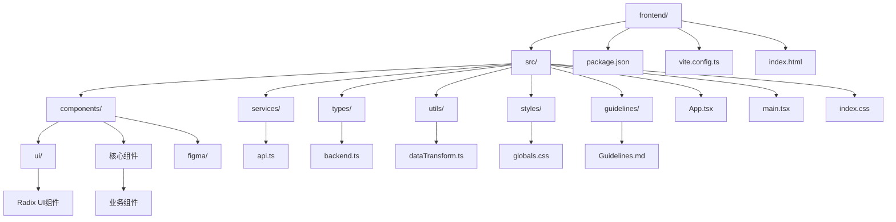

## 3. 核心架构图

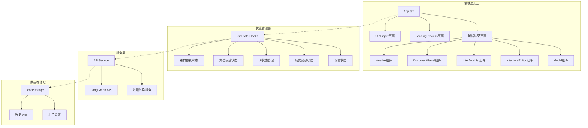

## 4. 组件模块图

### 4.1 页面级组件架构

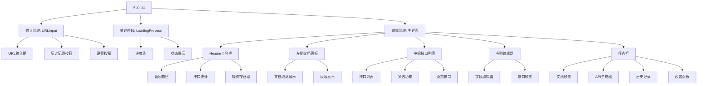

### 4.2 业务组件依赖关系

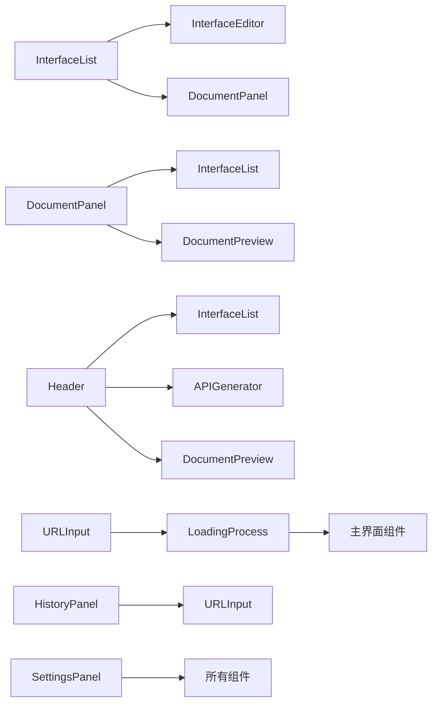

## 5. 数据流图

### 5.1 完整数据处理流程

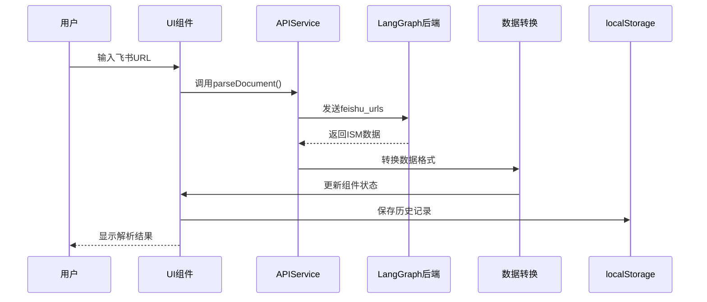

### 5.2 状态管理数据流

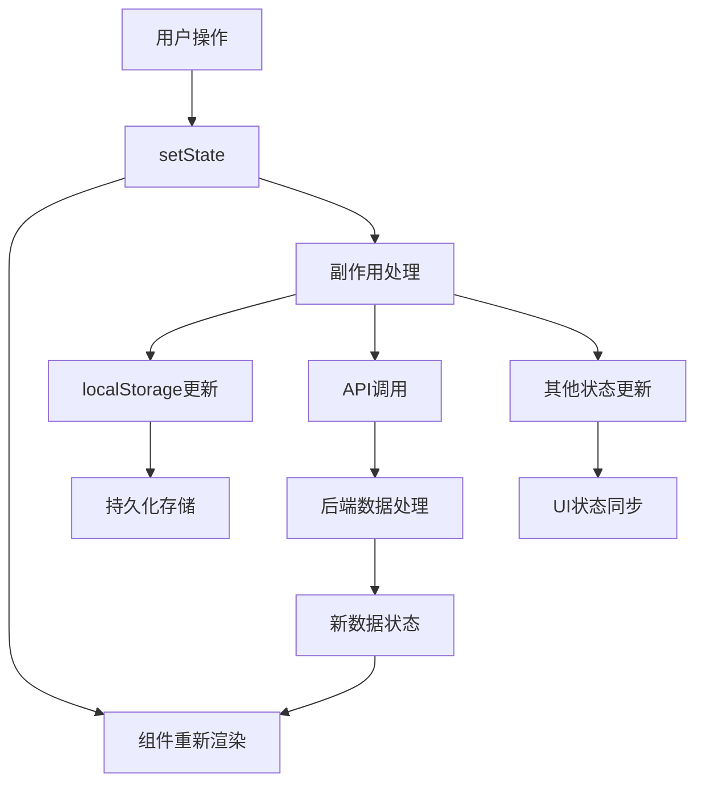

## 6. 状态管理架构

### 6.1 状态分类

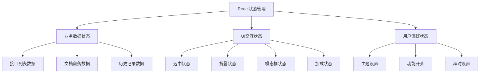

### 6.2 状态持久化策略

| 状态类型 | 存储方式 | 持久化时机 | 恢复时机 |
|---------|---------|-----------|----------|
| 历史记录 | localStorage | 新增记录时 | 应用启动时 |
| 用户设置 | localStorage | 设置变更时 | 应用启动时 |
| 接口数据 | 内存状态 | 实时更新 | 重新解析时 |
| UI状态 | 内存状态 | 不持久化 | 默认值初始化 |

## 7. API集成架构

### 7.1 后端服务集成

```mermaid
graph TB
    A[APIService] --> B[LangGraph Studio API]
    
    A --> C[核心方法]
    C --> D[createThread()]
    C --> E[runWorkflow()]
    C --> F[parseDocument()]
    C --> G[extractBackendData()]
    
    B --> H[线程管理]
    B --> I[工作流执行]
    B --> J[结果获取]
    
    D --> K[POST /threads]
    E --> L[POST /threads/{id}/runs/wait]
    F --> M[组合调用]
    G --> N[数据验证]
```

### 7.2 数据转换流程

```mermaid
graph LR
    A[BackendWorkflowResponse] --> B[ISMData]
    B --> C[InterfaceData[]]
    B --> D[DocumentMeta]
    
    C --> E[transformISMToInterfaces()]
    C --> F[transformISMToDocumentSections()]
    
    E --> G[APIInterface[]]
    F --> H[DocumentSection[]]
    
    G --> I[InterfaceList组件]
    H --> J[DocumentPanel组件]
```

## 8. UI组件库架构

### 8.1 Radix UI集成

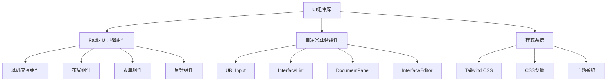

### 8.2 主题系统设计

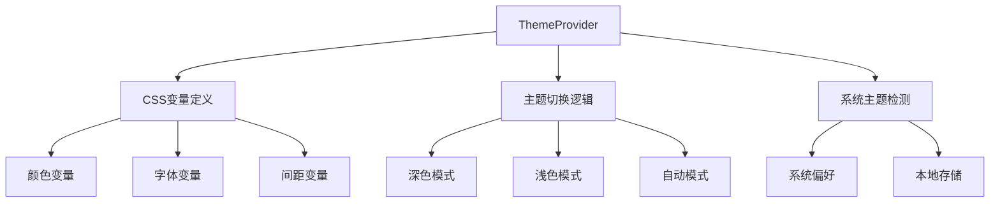

## 9. 性能优化架构

### 9.1 组件优化策略

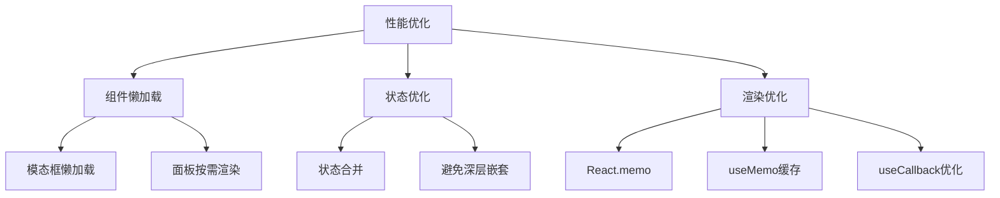

### 9.2 构建优化

- **Vite配置**: 支持SWC快速编译
- **路径别名**: 简化模块导入
- **代码分割**: 自动chunk分割
- **Tree Shaking**: 移除未使用代码
- **压缩优化**: 生产环境自动压缩

## 10. 错误处理架构

### 10.1 错误处理流程

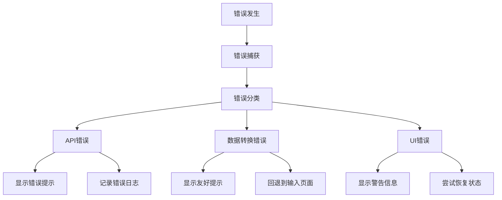

### 10.2 用户反馈系统

- **成功通知**: Sonner成功提示
- **错误提示**: 详细的错误信息
- **加载状态**: 进度条和状态文本
- **操作确认**: 关键操作二次确认

## 总结

这个前端项目采用了现代化的React技术栈，通过清晰的架构分层实现了：

1. **模块化设计**: 组件职责单一，便于维护和扩展
2. **类型安全**: TypeScript全面覆盖，减少运行时错误
3. **用户体验**: 流畅的交互和状态管理
4. **性能优化**: 多种优化策略确保响应速度
5. **错误处理**: 完善的错误捕获和用户反馈机制

整个架构支持从飞书文档解析到API接口生成的完整工作流程，为用户提供了直观高效的操作体验。